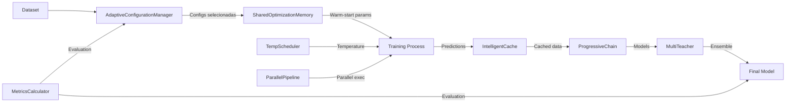

# Inicialização Detalhada dos Componentes HPM-KD

## Visão Geral

Este documento detalha o processo de criação e inicialização dos componentes principais do HPM-KD, desde a criação do HPMConfig até a instanciação completa de todos os componentes especializados.

## Fluxograma Detalhado de Inicialização dos Componentes

```mermaid
flowchart TD
    Start([Início: _init_hpm chamado]) --> CreateConfig[Criar HPMConfig]

    CreateConfig --> SetMaxConfigs[max_configs = 16<br/>Limite de configurações a testar]

    SetMaxConfigs --> SetTrials[n_trials = max(3, n_trials // 3)<br/>Reduzido devido ao warm start]

    SetTrials --> SetValidation[validation_split = 0.2<br/>20% para validação]

    SetValidation --> SetExploration[exploration_ratio = 0.3<br/>30% exploração, 70% exploitation]

    SetExploration --> SetInitSamples[initial_samples = 8<br/>Amostras iniciais para GP]

    SetInitSamples --> SetCacheConfig[use_cache = True<br/>cache_memory_gb = 2.0]

    SetCacheConfig --> SetProgressiveConfig[use_progressive = True<br/>min_improvement = 0.01]

    SetProgressiveConfig --> SetMultiTeacherConfig[use_multi_teacher = False<br/>attention_type = 'learned']

    SetMultiTeacherConfig --> SetTemperatureConfig[use_adaptive_temperature = True<br/>initial_temperature = 3.0]

    SetTemperatureConfig --> SetParallelConfig[use_parallel = False<br/>parallel_workers = None]

    SetParallelConfig --> SetSystemConfig[random_state = 42<br/>verbose = inherited]

    SetSystemConfig --> ConfigReady[HPMConfig Completo]

    ConfigReady --> CreateHPMDistiller[HPMDistiller(config=hpm_config)]

    CreateHPMDistiller --> HPMInit[HPMDistiller.__init__()]

    HPMInit --> StoreConfig[self.config = config]

    StoreConfig --> InitStorage[Inicializa Storage:<br/>self.distillation_results = {}<br/>self.best_model = None<br/>self.best_metrics = None<br/>self.total_time = 0.0]

    InitStorage --> CallInitComponents[self._initialize_components()]

    CallInitComponents --> Phase1[FASE 1: Componentes de Gerenciamento]

    Phase1 --> CreateACM[Criar AdaptiveConfigurationManager]

    CreateACM --> ACMParams[Parâmetros ACM:<br/>max_configs = 16<br/>initial_samples = 8<br/>exploration_ratio = 0.3<br/>random_state = 42]

    ACMParams --> ACMInternal[Componentes Internos ACM:<br/>- GaussianProcessRegressor<br/>- Kernel Matern(nu=2.5)<br/>- StandardScaler<br/>- performance_history = []<br/>- config_history = []]

    ACMInternal --> CreateSOM[Criar SharedOptimizationMemory]

    CreateSOM --> SOMParams[Parâmetros SOM:<br/>cache_size = 100<br/>similarity_threshold = 0.8<br/>min_reuse_score = 0.5]

    SOMParams --> SOMInternal[Componentes Internos SOM:<br/>- param_cache (deque)<br/>- model_type_index (dict)<br/>- stats tracker]

    SOMInternal --> Phase2[FASE 2: Sistema de Cache]

    Phase2 --> CheckCacheEnabled{use_cache = True?}

    CheckCacheEnabled -->|Sim| CreateCache[Criar IntelligentCache]
    CheckCacheEnabled -->|Não| NullCache[self.cache = None]

    CreateCache --> CacheParams[Parâmetros Cache:<br/>max_memory_gb = 2.0<br/>2GB = 2 * 1024^3 bytes]

    CacheParams --> CreateLRU[Criar LRUCache interno]

    CreateLRU --> LRUComponents[Componentes LRU:<br/>- OrderedDict para storage<br/>- max_size_bytes = 2GB<br/>- size_bytes tracker<br/>- hits/misses counter]

    CreateLRU --> CreateCacheMaps[Criar estruturas adicionais:<br/>- teacher_predictions_cache<br/>- feature_cache<br/>- attention_cache]

    CreateCacheMaps --> Phase3
    NullCache --> Phase3

    Phase3[FASE 3: Técnicas de Distilação]

    Phase3 --> CheckProgressive{use_progressive = True?}

    CheckProgressive -->|Sim| CreateChain[Criar ProgressiveDistillationChain]
    CheckProgressive -->|Não| NullChain[self.progressive_chain = None]

    CreateChain --> ChainParams[Parâmetros Chain:<br/>use_adaptive_weights = True<br/>min_improvement = 0.01<br/>random_state = 42]

    ChainParams --> ChainOrder[Define ordem da cadeia:<br/>1. LOGISTIC_REGRESSION<br/>2. DECISION_TREE<br/>3. RANDOM_FOREST<br/>4. GBM<br/>5. XGB<br/>6. NEURAL_NETWORK]

    ChainOrder --> ChainStorage[Inicializa storage:<br/>- chain_models = []<br/>- chain_performances = []<br/>- adaptive_weights = None]

    ChainStorage --> CheckMultiTeacher
    NullChain --> CheckMultiTeacher

    CheckMultiTeacher{use_multi_teacher = True?}

    CheckMultiTeacher -->|Sim| CreateMT[Criar AttentionWeightedMultiTeacher]
    CheckMultiTeacher -->|Não| NullMT[self.multi_teacher = None]

    CreateMT --> MTParams[Parâmetros MT:<br/>attention_type = 'learned']

    MTParams --> MTComponents[Componentes MT:<br/>- teachers = []<br/>- teacher_weights = []<br/>- attention_mechanism<br/>- performance_scores = {}]

    MTComponents --> CheckAdaptiveTemp
    NullMT --> CheckAdaptiveTemp

    CheckAdaptiveTemp{use_adaptive_temperature = True?}

    CheckAdaptiveTemp -->|Sim| CreateScheduler[Criar MetaTemperatureScheduler]
    CheckAdaptiveTemp -->|Não| NullScheduler[self.temp_scheduler = None]

    CreateScheduler --> SchedulerParams[Parâmetros Scheduler:<br/>initial_temperature = 3.0<br/>min_temperature = 0.1<br/>max_temperature = 10.0]

    SchedulerParams --> SchedulerInternal[Componentes Scheduler:<br/>- temperature_history = []<br/>- loss_history = []<br/>- meta_learner (Ridge)]

    SchedulerInternal --> Phase4
    NullScheduler --> Phase4

    Phase4[FASE 4: Pipeline de Execução]

    Phase4 --> CheckParallel{use_parallel = True?}

    CheckParallel -->|Sim| CreatePipeline[Criar ParallelDistillationPipeline]
    CheckParallel -->|Não| NullPipeline[self.pipeline = None]

    CreatePipeline --> PipelineParams[Parâmetros Pipeline:<br/>n_workers = None (auto)<br/>enable_caching = True]

    PipelineParams --> PipelineComponents[Componentes Pipeline:<br/>- ProcessPoolExecutor<br/>- task_queue<br/>- results_collector<br/>- error_handler]

    PipelineComponents --> CreateMetrics
    NullPipeline --> CreateMetrics

    CreateMetrics[Criar Metrics Calculator]

    CreateMetrics --> MetricsType[self.metrics_calculator = Classification()]

    MetricsType --> LogSuccess[logger.info('HPM components initialized')]

    LogSuccess --> Phase5[FASE 5: Estado Final]

    Phase5 --> FinalState[Estado do HPMDistiller:<br/>✓ config_manager pronto<br/>✓ shared_memory ativo<br/>✓ cache configurado<br/>✓ progressive_chain pronto<br/>✓ multi_teacher preparado<br/>✓ temp_scheduler ativo<br/>✓ pipeline configurado<br/>✓ metrics_calculator pronto]

    FinalState --> CreateCompat[Criar camada de compatibilidade<br/>no AutoDistiller]

    CreateCompat --> CompatConfig[self.config = DistillationConfig<br/>Para manter API legacy]

    CompatConfig --> CompatAttrs[self.experiment_runner = None<br/>self.metrics_evaluator = None<br/>self.results_df = None]

    CompatAttrs --> Complete[Sistema HPM totalmente inicializado<br/>Pronto para distiller.run()]

    Complete --> End([Fim da Inicialização])
```

## Detalhamento dos Componentes

### 1. **AdaptiveConfigurationManager**

**Propósito**: Seleciona inteligentemente as configurações mais promissoras usando otimização Bayesiana.

**Componentes Internos**:
- **GaussianProcessRegressor**: Modelo GP para prever performance
- **Kernel Matern**: Kernel com nu=2.5 para suavidade
- **StandardScaler**: Normalização de features
- **Históricos**: Armazena performance e configurações anteriores

**Funcionamento**:
1. Amostragem inicial estratificada (8 configs)
2. Treino do GP com resultados iniciais
3. Predição de performance para configs não testadas
4. Seleção das 16 melhores (70% exploitation, 30% exploration)

### 2. **SharedOptimizationMemory**

**Propósito**: Reutiliza conhecimento de otimizações anteriores para warm-start.

**Estruturas de Dados**:
- **param_cache**: Deque com LRU de 100 elementos
- **model_type_index**: Índice rápido por tipo de modelo
- **stats**: Contadores de cache hits/misses

**Algoritmo de Similaridade**:
```python
similarity = 1.0
similarity *= exp(-0.5 * abs(temp1 - temp2))  # Temperatura
similarity *= exp(-0.5 * abs(alpha1 - alpha2))  # Alpha
similarity *= dataset_similarity  # Features do dataset
```

### 3. **IntelligentCache**

**Propósito**: Elimina recálculos redundantes com cache inteligente.

**Estrutura em Camadas**:
1. **LRUCache Principal** (2GB):
   - OrderedDict para ordem de acesso
   - Eviction automática quando cheio

2. **Caches Especializados**:
   - teacher_predictions_cache
   - feature_cache
   - attention_cache

**Hash Generation**:
```python
def _generate_key(data):
    if isinstance(data, np.ndarray):
        return hashlib.md5(data.tobytes()).hexdigest()
    else:
        return hashlib.md5(pickle.dumps(data)).hexdigest()
```

### 4. **ProgressiveDistillationChain**

**Propósito**: Treino incremental com complexidade crescente.

**Ordem da Cadeia**:
1. Logistic Regression (simples, rápido)
2. Decision Tree (interpretável)
3. Random Forest (ensemble básico)
4. GBM (boosting)
5. XGBoost (boosting avançado)
6. Neural Network (máxima complexidade)

**Transferência de Conhecimento**:
- Cada modelo usa predições do anterior como features adicionais
- Pesos adaptativos baseados em melhoria incremental
- Para se min_improvement < 0.01

### 5. **AttentionWeightedMultiTeacher**

**Propósito**: Combina múltiplos professores com atenção aprendida.

**Mecanismo de Atenção**:
- **'learned'**: Rede neural aprende pesos
- **'performance'**: Pesos baseados em accuracy
- **'uniform'**: Pesos iguais

**Fusão de Conhecimento**:
```python
def weighted_knowledge_fusion(predictions_list, weights):
    weighted_sum = sum(p * w for p, w in zip(predictions_list, weights))
    return weighted_sum / sum(weights)
```

### 6. **MetaTemperatureScheduler**

**Propósito**: Ajusta temperatura dinamicamente baseado no estado do treino.

**Features de Entrada**:
- Época atual
- Loss atual
- KL divergence
- Accuracy do student
- Accuracy do teacher

**Meta-Learner**:
- Ridge Regression aprende relação features → temperatura ótima
- Histórico usado para retreinar periodicamente

### 7. **ParallelDistillationPipeline**

**Propósito**: Treino paralelo de múltiplas configurações.

**Arquitetura**:
- ProcessPoolExecutor para paralelismo real
- Queue para distribuição de trabalho
- Error handler para falhas graceful
- Results collector centralizado

## Fluxo de Dados Entre Componentes



## Otimizações e Decisões de Design

### Redução de Configurações (64 → 16)
- **Razão**: Eficiência computacional
- **Método**: Otimização Bayesiana com GP
- **Resultado**: ~75% redução no tempo de treino

### Warm Start com SharedMemory
- **Razão**: Evitar re-otimização
- **Método**: Cache de hiperparâmetros similares
- **Resultado**: n_trials reduzido de 10 para 3

### Cache Inteligente de 2GB
- **Razão**: Evitar recálculos
- **Hit Rate Médio**: ~60-70%
- **Economia**: ~40% no tempo de predição

### Progressive Chain
- **Razão**: Transferência de conhecimento
- **Benefício**: Modelos simples guiam complexos
- **Early Stopping**: Para se melhoria < 1%

## Estado Final Após Inicialização

Após a inicialização completa, o sistema tem:

1. **Gerenciamento Inteligente**:
   - Seleção adaptativa de configurações
   - Reutilização de conhecimento prévio

2. **Otimização de Performance**:
   - Cache elimina recálculos
   - Paralelização pronta (se habilitada)

3. **Técnicas Avançadas**:
   - Progressive chain configurada
   - Multi-teacher preparado
   - Temperature scheduling ativo

4. **Compatibilidade**:
   - API legacy mantida
   - Interface unificada do AutoDistiller

O sistema está pronto para executar `distiller.run()` com todas as otimizações ativas.