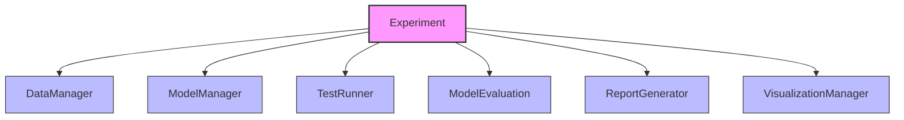

# DeepBridge Experiment Module Documentation

The experiment module provides a comprehensive framework for conducting machine learning experiments, evaluating models, and generating reports. It follows a modular design with specialized components for different aspects of experimentation.

## Key Components

### Experiment (experiment.py)

Central coordinator for experiment workflows that orchestrates the testing, evaluation and visualization processes. The Experiment class has been refactored to follow a delegation pattern, with specialized components handling distinct responsibilities.

**Main functionalities:**
- Managing experiment configurations and execution
- Delegating to specialized managers for specific test types
- Coordinating model training and evaluation
- Generating comprehensive reports
- Creating visualizations for different aspects (robustness, uncertainty)

**Core Components:**
1. **DataManager**: Handles data preparation and splitting
2. **ModelManager**: Creates and manages models and distillation processes
3. **TestRunner**: Coordinates execution of test suites
4. **ModelEvaluation**: Provides metrics calculation
5. **ReportGenerator**: Creates reports from experiment results
6. **VisualizationManager**: Coordinates visualization creation

#### Delegation Architecture

The Experiment class uses a delegation pattern to distribute responsibilities:



### DataManager (data_manager.py)

Handles data preparation, partitioning, and dataset management.

**Main functionalities:**
- Preparing data for experiments (train/test splits)
- Managing dataset formatting and transformations
- Providing interfaces to access data subsets

**Key Methods:**
- `prepare_data()`: Splits data into training and testing sets
- Accessors for X_train, X_test, y_train, y_test

### TestRunner (test_runner.py)

Coordinates test execution across different test suites.

**Main functionalities:**
- Running specified test configurations
- Collecting and organizing test results
- Supporting different test types through specialized managers

**Key Methods:**
- `run_tests(config_name)`: Executes tests with specified configuration
- `run_initial_tests()`: Runs tests during initialization
- `get_test_results(test_type)`: Retrieves results for specific test type

### Specialized Managers

The module implements a manager pattern with specialized components:

#### ModelManager (managers/model_manager.py)

Handles model creation, training, and distillation.

**Main functionalities:**
- Creating model instances based on configuration
- Managing model distillation processes
- Creating alternative models for comparison

**Key Methods:**
- `create_distillation_model()`: Creates and configures distillation models
- `create_alternative_models()`: Creates additional models for comparison
- `get_default_model_type()`: Returns default model for auto-fitting

#### RobustnessManager (managers/robustness_manager.py)

Evaluates model stability under data perturbations.

**Main functionalities:**
- Running robustness tests with various perturbation types
- Comparing robustness metrics across models
- Generating robustness visualizations and reports

#### HyperparameterManager (managers/hyperparameter_manager.py)

Analyzes model sensitivity to hyperparameter changes.

**Main functionalities:**
- Testing model performance across hyperparameter variations
- Identifying critical hyperparameters
- Comparing hyperparameter importance between models

#### UncertaintyManager (managers/uncertainty_manager.py)

Evaluates model uncertainty estimation capabilities.

**Main functionalities:**
- Measuring prediction uncertainty metrics
- Assessing calibration quality
- Visualizing uncertainty distributions

#### ResilienceManager (managers/resilience_manager.py)

Tests model performance under adverse conditions.

**Main functionalities:**
- Evaluating model behavior with incomplete or noisy data
- Measuring resistance to adversarial attacks
- Assessing computational resilience

### VisualizationManager (visualization_manager.py)

Centralizes visualization capabilities across different test types.

**Main functionalities:**
- Creating standardized plots for test results
- Supporting interactive visualization options
- Generating comparative visualizations between models
- Providing a consistent API for accessing visualizations

**Key Methods:**
- `get_*_results()`: Methods to access results for different test types
- `plot_*()`: Methods to retrieve specific visualization types
- Integration with manager-created visualizations

### ModelEvaluation (model_evaluation.py)

Provides metrics calculation and model evaluation capabilities.

**Main functionalities:**
- Calculating performance metrics for different model types
- Generating performance comparisons
- Evaluating distillation effectiveness

**Key Methods:**
- `evaluate_distillation()`: Evaluates distilled model performance
- `calculate_metrics()`: Computes metrics based on predictions
- `compare_all_models()`: Generates comparison across model types

### ReportGenerator (report_generator.py)

Creates comprehensive reports from experiment results.

**Main functionalities:**
- Organizing results in a structured format
- Generating HTML reports with visualizations
- Customizing report format based on experiment type

**Key Methods:**
- `generate_comprehensive_results()`: Creates structured results dictionary
- `save_report()`: Generates and saves HTML report

## Architecture Overview

The experiment module follows a well-structured component architecture:

1. **The `Experiment` class** acts as the main entry point and coordinator
2. **Specialized managers** implement specific testing capabilities
3. **The `DataManager`** provides consistent data access
4. **The `TestRunner`** coordinates test execution
5. **The `VisualizationManager`** centralizes visualization
6. **The `ModelEvaluation` and `ReportGenerator`** provide evaluation and reporting

This architecture supports extensibility through the addition of new manager types, while maintaining a consistent interface for experiment execution and reporting.

## Usage Pattern

The typical usage follows this pattern:

```python
from deepbridge.core.experiment import Experiment
from deepbridge.core.db_data import DBDataset

# Create dataset
dataset = DBDataset(
    data=my_dataframe,
    target_column='target'
)

# Initialize experiment with tests
experiment = Experiment(
    dataset=dataset,
    experiment_type='binary_classification',
    tests=['robustness', 'uncertainty']
)

# Train a distilled model (optional if dataset already has a model)
experiment.fit(
    student_model_type='random_forest',
    distillation_method='knowledge_distillation',
    temperature=2.0
)

# Run more detailed tests
results = experiment.run_tests(config_name='medium')

# Generate visualizations
robustness_plot = experiment.plot_robustness_comparison()

# Save comprehensive report
experiment.save_report('experiment_report.html')
```

## Key Classes and Responsibilities

### Experiment Class

**Primary Responsibilities:**
- Experiment configuration and initialization
- Logging configuration
- Test execution coordination
- Reporting and visualization access

**Key Methods:**
- `__init__()`: Initializes the experiment with configuration and components
- `fit()`: Trains a model using distillation techniques
- `run_tests()`: Executes tests across different managers
- `save_report()`: Generates and saves experiment report
- `get_comprehensive_results()`: Returns complete results dictionary
- Visualization methods: Delegates to VisualizationManager

### DataManager Class

**Primary Responsibilities:**
- Data preparation and splitting
- Maintaining access to data subsets

**Key Methods:**
- `prepare_data()`: Splits data into training/testing
- Properties for accessing data (X_train, y_test, etc.)

### TestRunner Class

**Primary Responsibilities:**
- Managing test execution
- Storing and retrieving test results

**Key Methods:**
- `run_tests()`: Executes tests with configuration
- `run_initial_tests()`: Runs quick tests during setup
- `get_test_results()`: Retrieves specific test results

### BaseManager and Specialized Managers

**Primary Responsibilities:**
- Implementing specific testing capabilities
- Generating test results and visualizations

**Key Methods:**
- `run_tests()`: Executes specific test suite
- `compare_models()`: Compares results across models
- Generation of visualizations and metrics

## Extension Points

The experiment architecture provides several extension points:

1. **New Manager Types**: Create new manager classes inheriting from BaseManager
2. **Additional Visualization Types**: Extend VisualizationManager with new methods
3. **Custom Report Templates**: Add new templates to ReportGenerator
4. **Alternative Model Types**: Register new model types with ModelManager

This modular design allows for customization while maintaining a consistent interface across all components.