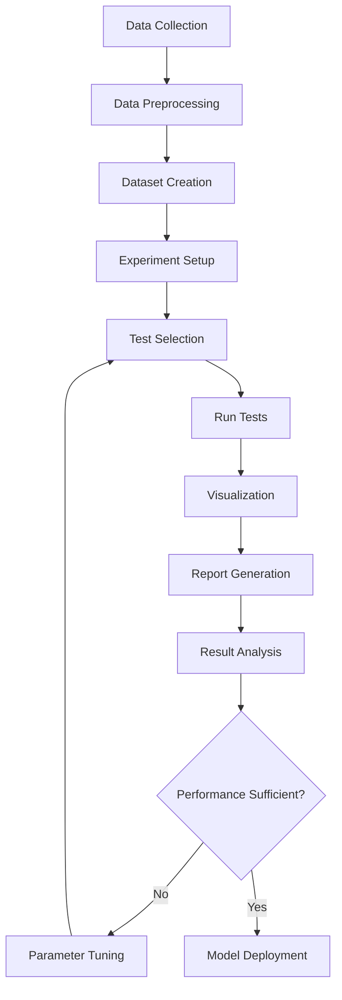

# Model Validation Guide

## Overview

Model validation is a critical process in machine learning that ensures your models are reliable, performant, and generalizable. DeepBridge's new component-based architecture provides comprehensive tools for validating ML models across multiple dimensions. This guide explains how to use the DeepBridge components for robust model validation.

## Validation Process Flowchart



## DeepBridge Validation Architecture

```
┌───────────────────┐
│  Experiment       │
└─────────┬─────────┘
          │
          ▼
┌───────────────────┐     ┌───────────────────┐
│  TestRunner       │────>│  Test Results     │
└─────────┬─────────┘     └─────────┬─────────┘
          │                         │
          ▼                         ▼
┌───────────────────┐     ┌───────────────────┐
│  Specialized      │     │  Visualization    │
│  Managers         │────>│  Manager          │
└───────────────────┘     └───────────────────┘
```

## Validation Using the Experiment Class

The `Experiment` class is the central component for model validation. It orchestrates:

1. Data management through `DataManager`
2. Test execution through `TestRunner` and specialized managers
3. Visualization through `VisualizationManager`
4. Reporting through `ReportGenerator`

```python
from deepbridge.core.experiment import Experiment
from deepbridge.core.db_data import DBDataset
from sklearn.ensemble import RandomForestClassifier
from sklearn.model_selection import train_test_split
import pandas as pd

# Load and prepare your data
data = pd.read_csv("your_dataset.csv")
X = data.drop(columns=["target"])
y = data["target"]
X_train, X_test, y_train, y_test = train_test_split(X, y, test_size=0.2, random_state=42)

# Create a model to test
model = RandomForestClassifier(n_estimators=100, random_state=42)
model.fit(X_train, y_train)

# Create a dataset with the model
dataset = DBDataset(
    data=X_train,
    target=y_train,
    test_data=X_test,
    test_target=y_test,
    model=model
)

# Initialize experiment with the tests you want to run
experiment = Experiment(
    dataset=dataset,
    experiment_type="binary_classification",
    tests=["robustness", "uncertainty", "resilience", "hyperparameters"]
)

# Run tests with specified configuration intensity
results = experiment.run_tests(config_name="medium")

# Generate comprehensive report
experiment.save_report("validation_report.html")
```

## Understanding Test Types

DeepBridge provides several specialized test types, each managed by a dedicated component:

### 1. Robustness Testing

Measures how model performance changes when input data is perturbed:

```python
# After creating experiment
robustness_results = experiment.get_robustness_results()

# Access specific robustness visualizations
robustness_plot = experiment.plot_robustness_comparison()
feature_importance = experiment.plot_feature_importance_robustness()
```

### 2. Uncertainty Testing

Evaluates the model's ability to quantify its own prediction uncertainty:

```python
# Access uncertainty results
uncertainty_results = experiment.get_uncertainty_results()

# Generate uncertainty visualizations
calibration_plot = experiment.plot_uncertainty_alpha_comparison()
width_distribution = experiment.plot_uncertainty_width_distribution()
```

### 3. Resilience Testing

Tests model behavior under adverse conditions like missing data:

```python
# Access resilience results
resilience_results = experiment.get_resilience_results()
```

### 4. Hyperparameter Importance

Analyzes how sensitive the model is to its hyperparameters:

```python
# Access hyperparameter importance
hyperparameter_results = experiment.get_hyperparameter_results()
hyperparameter_importance = experiment.get_hyperparameter_importance()
tuning_order = experiment.get_hyperparameter_tuning_order()
```

## Working with Test Managers Directly

For more control, you can work directly with the specialized test managers:

```python
from deepbridge.core.experiment.managers.robustness_manager import RobustnessManager

# Create robustness manager
robustness_manager = RobustnessManager(
    dataset=dataset,
    alternative_models={
        "logistic_regression": logistic_model,
        "decision_tree": decision_tree_model
    },
    verbose=True
)

# Run robustness tests with full configuration
results = robustness_manager.run_tests(config_name="full")

# Compare different models
comparison = robustness_manager.compare_models()
```

## Validation Configurations

DeepBridge supports different test configurations:

1. **Quick**: Fast tests with minimal computational requirements
2. **Medium**: Balanced approach with moderate depth
3. **Full**: Comprehensive testing for thorough validation

```python
# Quick tests for rapid iteration
quick_results = experiment.run_tests(config_name="quick")

# Comprehensive tests for final validation
full_results = experiment.run_tests(config_name="full")
```

## Alternative Model Comparison

DeepBridge automatically creates and tests alternative models:

```python
# Create experiment with alternative model comparison
experiment = Experiment(
    dataset=dataset,
    experiment_type="binary_classification",
    tests=["robustness"],
    # Alternative models are automatically created
)

# Run tests to compare models
experiment.run_tests()

# Get model comparison results
comparison_plot = experiment.plot_robustness_comparison()
```

## Best Practices

### 1. Data Preparation

- Use the `DBDataset` class to properly structure your data
- Include both training and test data for comprehensive validation
- Provide an already trained model if you want to validate it

```python
# Create complete dataset for validation
dataset = DBDataset(
    data=X_train,
    target=y_train,
    test_data=X_test,
    test_target=y_test,
    model=model,
    features=feature_names,  # Optional: provide feature names
    categorical_features=cat_features  # Optional: identify categorical features
)
```

### 2. Multi-dimensional Validation

Always test your models across multiple dimensions:

```python
# Create experiment with multiple test types
experiment = Experiment(
    dataset=dataset,
    experiment_type="binary_classification",
    tests=[
        "robustness",  # Test stability under perturbations
        "uncertainty",  # Test confidence calibration
        "resilience",  # Test behavior with missing data
        "hyperparameters"  # Test parameter sensitivity
    ]
)
```

### 3. Visualization for Insight

Use the visualization system to gain deeper insights:

```python
# Create multiple visualizations
visualizations = {
    "robustness_comparison": experiment.plot_robustness_comparison(),
    "feature_importance": experiment.plot_feature_importance_robustness(),
    "methods_comparison": experiment.plot_perturbation_methods_comparison(),
    "uncertainty": experiment.plot_uncertainty_alpha_comparison()
}

# Visualizations can be displayed in notebooks or saved
for name, fig in visualizations.items():
    fig.write_html(f"{name}.html")
```

### 4. Comprehensive Reporting

Always generate and save comprehensive reports:

```python
# Generate and save detailed HTML report
report_path = experiment.save_report("validation_report.html")
print(f"Report saved to: {report_path}")
```

## Common Pitfalls and Solutions

### Overfitting Detection

DeepBridge helps identify overfitting by comparing training and test performance:

```python
# Compare train vs test performance
results = experiment.compare_all_models(dataset="test")
train_results = experiment.compare_all_models(dataset="train")

# Large differences between train and test performance indicate overfitting
```

### Data Leakage Prevention

The component architecture helps prevent data leakage:

```python
# DataManager handles train/test splitting properly
dataset = DBDataset(
    data=full_data,
    target_column="target",
    test_size=0.2,  # Proper split with no leakage
    random_state=42
)

# Experiment creates a clean validation pipeline
experiment = Experiment(dataset=dataset, ...)
```

### Resource Management

Configure test intensity based on your computational resources:

```python
# Quick tests for rapid iteration
quick_results = experiment.run_tests(config_name="quick")

# Use medium configuration for balanced validation
medium_results = experiment.run_tests(config_name="medium")

# Full tests for final validation when resources allow
full_results = experiment.run_tests(config_name="full")
```

## Conclusion

DeepBridge's component-based architecture provides a comprehensive framework for validating machine learning models. By using the `Experiment` class and specialized managers, you can evaluate models across multiple dimensions and gain confidence in their reliability and performance.

## Additional Resources

- [Experiment Documentation](../api/experiment_documentation.md)
- [TestRunner Documentation](../api/test_runner_documentation.md)
- [Component Integration Guide](../api/component_integration_guide.md)
- [Specialized Managers Documentation](../api/specialized_managers_documentation.md)