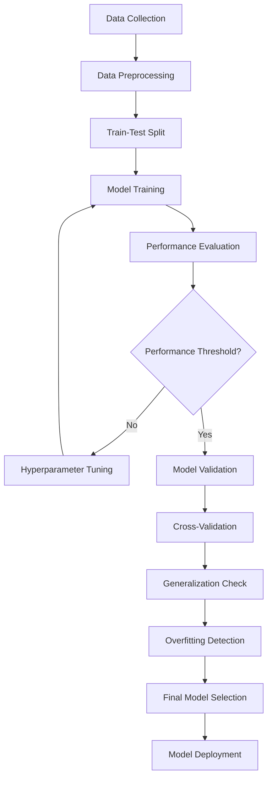

# Model Validation Guide

## Overview of Model Validation

Model validation is a critical process in machine learning that ensures your models are reliable, performant, and generalizable. This guide will walk you through comprehensive strategies for validating machine learning models using DeepBridge.

## Validation Process Flowchart



## Key Validation Strategies

### 1. Comprehensive Model Validation

```python
import pandas as pd
import numpy as np
from sklearn.model_selection import train_test_split, cross_val_score, StratifiedKFold
from sklearn.preprocessing import StandardScaler
from sklearn.pipeline import Pipeline
from sklearn.ensemble import RandomForestClassifier
from sklearn.metrics import (
    accuracy_score, 
    precision_score, 
    recall_score, 
    f1_score, 
    roc_auc_score, 
    confusion_matrix
)
from deepbridge.model_validation import ModelValidation

class RobustModelValidator:
    """
    Advanced model validation with multiple checks and strategies
    """
    def __init__(self, data, target_column):
        """
        Initialize validator with dataset
        
        Args:
            data (pd.DataFrame): Full dataset
            target_column (str): Name of the target variable
        """
        self.data = data
        self.target_column = target_column
        self.X = data.drop(columns=[target_column])
        self.y = data[target_column]
    
    def validate_model(self, model, validation_strategies=None):
        """
        Perform comprehensive model validation
        
        Args:
            model (BaseEstimator): Model to validate
            validation_strategies (dict): Custom validation parameters
        
        Returns:
            dict: Comprehensive validation results
        """
        # Default validation strategies
        default_strategies = {
            'train_test_split_ratio': 0.2,
            'cross_validation_folds': 5,
            'performance_thresholds': {
                'accuracy': 0.7,
                'precision': 0.65,
                'recall': 0.65,
                'f1_score': 0.7,
                'roc_auc': 0.75
            }
        }
        
        # Merge default and custom strategies
        strategies = {**default_strategies, **(validation_strategies or {})}
        
        # Validation results
        validation_results = {
            'preprocessing': {},
            'train_test_split': {},
            'cross_validation': {},
            'performance_metrics': {},
            'overfitting_check': {},
            'recommendations': []
        }
        
        try:
            # 1. Preprocessing and Feature Scaling
            scaler = StandardScaler()
            X_scaled = scaler.fit_transform(self.X)
            validation_results['preprocessing']['scaled_features'] = X_scaled.shape
            
            # 2. Train-Test Split
            X_train, X_test, y_train, y_test = train_test_split(
                X_scaled, 
                self.y, 
                test_size=strategies['train_test_split_ratio'], 
                random_state=42,
                stratify=self.y
            )
            validation_results['train_test_split'] = {
                'train_size': len(X_train),
                'test_size': len(X_test)
            }
            
            # 3. Cross-Validation
            cv = StratifiedKFold(
                n_splits=strategies['cross_validation_folds'], 
                shuffle=True, 
                random_state=42
            )
            cv_scores = cross_val_score(
                model, 
                X_scaled, 
                self.y, 
                cv=cv, 
                scoring='accuracy'
            )
            validation_results['cross_validation'] = {
                'mean_cv_score': cv_scores.mean(),
                'std_cv_score': cv_scores.std(),
                'individual_fold_scores': cv_scores.tolist()
            }
            
            # 4. Model Training and Evaluation
            model.fit(X_train, y_train)
            y_pred = model.predict(X_test)
            y_pred_proba = model.predict_proba(X_test)[:, 1]
            
            # Calculate performance metrics
            performance_metrics = {
                'accuracy': accuracy_score(y_test, y_pred),
                'precision': precision_score(y_test, y_pred),
                'recall': recall_score(y_test, y_pred),
                'f1_score': f1_score(y_test, y_pred),
                'roc_auc': roc_auc_score(y_test, y_pred_proba),
                'confusion_matrix': confusion_matrix(y_test, y_pred).tolist()
            }
            validation_results['performance_metrics'] = performance_metrics
            
            # 5. Overfitting Check
            train_pred = model.predict(X_train)
            train_accuracy = accuracy_score(y_train, train_pred)
            test_accuracy = performance_metrics['accuracy']
            
            overfitting_check = {
                'train_accuracy': train_accuracy,
                'test_accuracy': test_accuracy,
                'accuracy_difference': abs(train_accuracy - test_accuracy)
            }
            validation_results['overfitting_check'] = overfitting_check
            
            # 6. Performance Recommendations
            recommendations = []
            for metric, threshold in strategies['performance_thresholds'].items():
                if performance_metrics[metric] < threshold:
                    recommendations.append(
                        f"Performance for {metric} is below threshold. "
                        "Consider model tuning or feature engineering."
                    )
            
            # Add overfitting warning
            if overfitting_check['accuracy_difference'] > 0.1:
                recommendations.append(
                    "Potential overfitting detected. "
                    "Consider regularization or more data."
                )
            
            validation_results['recommendations'] = recommendations
            
            return validation_results
        
        except Exception as e:
            print(f"Validation error: {e}")
            raise
    
    def create_experiment(self, model):
        """
        Create a ModelValidation experiment
        
        Args:
            model (BaseEstimator): Model to validate
        
        Returns:
            ModelValidation: Experiment instance
        """
        experiment = ModelValidation(
            experiment_name=f"{type(model).__name__}_validation"
        )
        
        # Split data
        X_train, X_test, y_train, y_test = train_test_split(
            self.X, self.y, test_size=0.2, random_state=42
        )
        
        # Add data to experiment
        experiment.add_data(
            X_train=X_train, 
            y_train=y_train, 
            X_test=X_test, 
            y_test=y_test
        )
        
        # Add model to experiment
        experiment.add_model(model, "primary_model")
        
        return experiment

# Example Usage
def run_model_validation():
    # Load your dataset
    data = pd.read_csv('your_dataset.csv')
    
    # Initialize validator
    validator = RobustModelValidator(data, target_column='target')
    
    # Create model
    model = RandomForestClassifier(n_estimators=100, random_state=42)
    
    try:
        # Validate model
        validation_results = validator.validate_model(model)
        
        # Print detailed results
        print("Model Validation Results:")
        for section, results in validation_results.items():
            print(f"\n{section.upper()}:")
            print(json.dumps(results, indent=2))
        
        # Create experiment
        experiment = validator.create_experiment(model)
        
        return validation_results, experiment
    
    except Exception as e:
        print(f"Validation process failed: {e}")

# Run validation
results, experiment = run_model_validation()
```

## Best Practices and Common Pitfalls

### Best Practices

1. **Data Preprocessing**
   - Always scale or normalize features
   - Handle missing values
   - Encode categorical variables
   - Remove or transform outliers

2. **Model Selection**
   - Use multiple models
   - Compare performance across different algorithms
   - Consider model complexity vs. interpretability

3. **Validation Techniques**
   - Use cross-validation
   - Stratify for imbalanced datasets
   - Use multiple evaluation metrics

### Common Pitfalls

1. **Overfitting**
   - Symptoms: Large gap between training and test performance
   - Solutions:
     - Use regularization
     - Collect more data
     - Reduce model complexity

2. **Data Leakage**
   - Avoid preprocessing entire dataset before splitting
   - Fit scalers/encoders only on training data
   - Use pipelines to prevent leakage

3. **Inappropriate Metrics**
   - Use multiple metrics
   - Consider domain-specific evaluation criteria
   - Be aware of class imbalance

## Advanced Validation Scenarios

### Handling Imbalanced Datasets

```python
from sklearn.utils import class_weight
from sklearn.metrics import balanced_accuracy_score, precision_recall_curve, average_precision_score

def validate_imbalanced_dataset(X, y, model):
    """
    Validate models on imbalanced datasets
    
    Args:
        X (np.ndarray): Features
        y (np.ndarray): Target variable
        model (BaseEstimator): Model to validate
    
    Returns:
        dict: Validation metrics for imbalanced data
    """
    # Calculate class weights
    class_weights = class_weight.compute_class_weight(
        'balanced', 
        classes=np.unique(y), 
        y=y
    )
    
    # Split data
    X_train, X_test, y_train, y_test = train_test_split(
        X, y, test_size=0.2, stratify=y, random_state=42
    )
    
    # Train model with class weights
    model.fit(X_train, y_train, sample_weight=class_weights)
    
    # Predictions
    y_pred = model.predict(X_test)
    y_pred_proba = model.predict_proba(X_test)[:, 1]
    
    # Advanced metrics
    balanced_accuracy = balanced_accuracy_score(y_test, y_pred)
    precision_recall_auc = average_precision_score(y_test, y_pred_proba)
    
    return {
        'balanced_accuracy': balanced_accuracy,
        'precision_recall_auc': precision_recall_auc
    }
```

## Conclusion

Model validation is an iterative and comprehensive process. Always:
- Be skeptical of your initial results
- Continuously validate and improve
- Understand your data and model's limitations

## Additional Resources
- [Scikit-learn Model Evaluation](https://scikit-learn.org/stable/model_evaluation.html)
- [Cross-Validation Guide](https://scikit-learn.org/stable/modules/cross_validation.html)
- [Model Validation Best Practices](https://ml-cheatsheet.readthedocs.io/en/latest/validation.html)

## Troubleshooting
- Unexpected results? Double-check data preprocessing
- Low performance? Try different models or feature engineering
- Overfitting? Implement regularization techniques