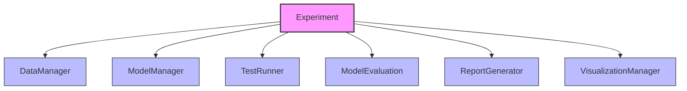

# DeepBridge Quick Start Guide

## Introduction

DeepBridge is a powerful Python library for machine learning model validation and distillation. This guide will help you quickly get started with the latest architecture, covering different scenarios and use cases.

## Installation

Install DeepBridge using pip:

```bash
pip install deepbridge
```

## DeepBridge Architecture Overview

DeepBridge has been redesigned with a modular, component-based architecture:



## Use Cases and Examples

[](https://colab.research.google.com/github/DeepBridge-Validation/DeepBridge/blob/master/examples/quickstart.ipynb)

### 1. Comprehensive Experiment

This example shows how to create a complete experiment with testing and visualization:

```python
from deepbridge.core.experiment import Experiment
from deepbridge.core.db_data import DBDataset
from sklearn.model_selection import train_test_split
from sklearn.datasets import make_classification

# Create synthetic data for demonstration
X, y = make_classification(n_samples=1000, n_features=20, 
                          n_informative=10, n_classes=2, 
                          random_state=42)

# Split data for test set
X_train, X_test, y_train, y_test = train_test_split(X, y, test_size=0.2, random_state=42)

# Create dataset
dataset = DBDataset(
    data=X_train,  # Training features
    target=y_train,  # Training labels
    test_data=X_test,  # Test features
    test_target=y_test  # Test labels
)

# Initialize experiment with tests to run
experiment = Experiment(
    dataset=dataset,
    experiment_type='binary_classification',
    tests=['robustness', 'uncertainty']
)

# Train a distilled model
experiment.fit(
    student_model_type='random_forest',
    distillation_method='knowledge_distillation',
    temperature=2.0,
    n_trials=10
)

# Run more detailed tests
results = experiment.run_tests(config_name='medium')

# Generate visualizations
robustness_plot = experiment.plot_robustness_comparison()
uncertainty_plot = experiment.plot_uncertainty_alpha_comparison()

# Save comprehensive report
experiment.save_report('experiment_report.html')
```

### 2. Direct Model Distillation

For more focused control over the distillation process:

```python
from deepbridge.distillation.techniques.knowledge_distillation import KnowledgeDistillation
from deepbridge.utils.model_registry import ModelType
import numpy as np
from sklearn.ensemble import RandomForestClassifier
from sklearn.model_selection import train_test_split

# Prepare data and teacher model
X_train, X_test, y_train, y_test = train_test_split(
    X, y, test_size=0.2, random_state=42
)

# Train teacher model
teacher_model = RandomForestClassifier(n_estimators=100, random_state=42)
teacher_model.fit(X_train, y_train)

# Create distiller with the teacher model
distiller = KnowledgeDistillation(
    teacher_model=teacher_model,
    student_model_type=ModelType.LOGISTIC_REGRESSION,
    temperature=2.0,
    alpha=0.5,
    n_trials=20
)

# Train the distilled model
distiller.fit(X_train, y_train)

# Evaluate performance
teacher_accuracy = teacher_model.score(X_test, y_test)
student_accuracy = distiller.score(X_test, y_test)

print(f"Teacher model accuracy: {teacher_accuracy:.4f}")
print(f"Student model accuracy: {student_accuracy:.4f}")
```

### 3. Robustness Testing

For evaluating model stability under perturbations:

```python
from deepbridge.core.experiment import Experiment
from deepbridge.core.db_data import DBDataset
from sklearn.ensemble import RandomForestClassifier

# Create and train a model
model = RandomForestClassifier(n_estimators=100, random_state=42)
model.fit(X_train, y_train)

# Create dataset with the model
dataset = DBDataset(
    data=X_train,
    target=y_train,
    test_data=X_test,
    test_target=y_test,
    model=model
)

# Initialize experiment with only robustness testing
experiment = Experiment(
    dataset=dataset,
    experiment_type='binary_classification',
    tests=['robustness']
)

# Run robustness tests
results = experiment.run_tests(config_name='full')

# Generate robustness visualizations
feature_importance = experiment.plot_feature_importance_robustness()
perturbation_comparison = experiment.plot_perturbation_methods_comparison()

# Save report
experiment.save_report('robustness_report.html')
```

### 4. Working with Component Managers Directly

For more advanced use cases, you can work directly with the specialized managers:

```python
from deepbridge.core.experiment.managers.robustness_manager import RobustnessManager
from deepbridge.core.db_data import DBDataset
from sklearn.ensemble import RandomForestClassifier

# Create and train a model
model = RandomForestClassifier(n_estimators=100, random_state=42)
model.fit(X_train, y_train)

# Create dataset with the model
dataset = DBDataset(
    data=X_train,
    target=y_train,
    test_data=X_test,
    test_target=y_test,
    model=model
)

# Create robustness manager directly
robustness_manager = RobustnessManager(
    dataset=dataset,
    alternative_models={
        'LogisticRegression': logistic_model,
        'DecisionTree': tree_model
    },
    verbose=True
)

# Run robustness tests
results = robustness_manager.run_tests(config_name='medium')

# Get comparison between models
comparison = robustness_manager.compare_models()

# Extract visualizations
visualizations = results.get('visualizations', {})
```

## Key Components and Concepts

### Experiment Class

The central coordinator that manages the testing, evaluation, and visualization workflow:

- Initializes with a dataset and test types to run
- Delegates to specialized managers for testing
- Provides access to visualizations and results
- Generates comprehensive reports

### DBDataset

Encapsulates data and models:

- Stores training and test data
- Manages model and probability storage
- Handles feature organization

### Specialized Managers

Each manager handles specific test types:

- **RobustnessManager**: Evaluates stability under perturbations
- **UncertaintyManager**: Assesses prediction confidence and calibration
- **ResilienceManager**: Tests performance under adverse conditions
- **HyperparameterManager**: Analyzes parameter sensitivity

### Visualization System

Provides tools for visual analysis:

- Integration through VisualizationManager
- Specialized visualizers for different test types
- Interactive Plotly-based graphs

## Next Steps

- Explore the [Architecture Documentation](../api/experiment_documentation.md)
- Learn about [Component Integration](../api/component_integration_guide.md)
- Try the [Robustness Testing](../concepts/robustness.md) capabilities
- Check the [API Reference](../api/experiment_class_documentation.md)

## Final Tips

1. Always start with a properly structured dataset using DBDataset
2. Use the Experiment class for coordinated testing
3. For specific tasks, consider working with specialized managers directly
4. Generate reports to document and share your findings
5. Explore different test configurations (quick, medium, full) based on your needs

## Troubleshooting

- **Installation Error**: Check Python version compatibility (3.8+)
- **Performance Issues**: Adjust test configuration to reduce computation
- **Visualization Errors**: Ensure Plotly is properly installed
- **Component Access**: Follow the delegation pattern for accessing components